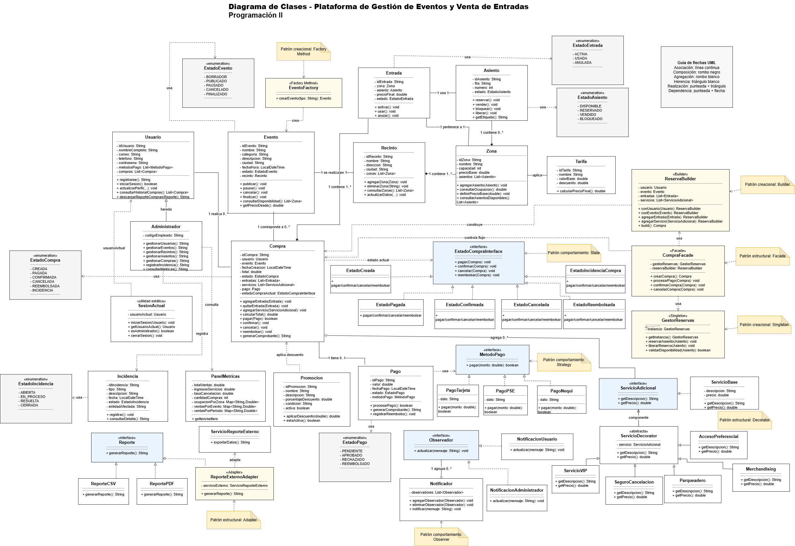

# Proyecto Final PGII  
## Plataforma de Gestión de Eventos y Venta de Entradas

**Programación II - Universidad del Quindío**

**Integrantes:**  
Juan José Téllez Sánchez  
Sofía Avilés Díaz  
Mariana Rodríguez Maya  

---

## Diagrama de clases

---

# 1. Pensamiento Computacional RF-043

## 1.1 ¿Qué se solicita finalmente?

Se solicita diseñar, antes de programar, una plataforma orientada a objetos para gestionar eventos y vender entradas.

El sistema debe permitir que un usuario pueda:

- Consultar eventos.
- Revisar disponibilidad.
- Seleccionar entradas.
- Realizar una compra.
- Pagar de forma simulada.
- Recibir notificaciones sobre cambios importantes.

También debe permitir que un administrador gestione:

- Eventos.
- Recintos.
- Zonas.
- Asientos.
- Incidencias.
- Métricas.

El objetivo principal de esta primera entrega es dejar bien organizado el diseño del sistema antes de pasar a la codificación en Java.

---

## 1.2 ¿Qué información es relevante?

La información más importante del sistema es:

- **Usuarios y administradores:** permiten diferenciar quién compra entradas y quién administra la plataforma.
- **Eventos:** son el elemento principal que se ofrece en el sistema.
- **Recintos, zonas y asientos:** permiten organizar el lugar donde se realiza cada evento.
- **Compras y entradas:** representan el proceso de venta y el acceso que recibe el usuario.
- **Pagos y métodos de pago:** permiten simular pagos con diferentes opciones.
- **Tarifas y servicios adicionales:** ayudan a calcular el valor final de la compra.
- **Incidencias, reportes y métricas:** ayudan al administrador a revisar problemas y resultados del sistema.

---

## 1.3 ¿Cómo se agrupa la información relevante?

La información se organiza en clases. Cada clase representa una parte importante de la plataforma y tiene una responsabilidad clara.

### Usuarios

- `Usuario`
- `Administrador`

Estas clases manejan el acceso al sistema y las acciones según el tipo de usuario.

### Eventos y espacios

- `Evento`
- `Recinto`
- `Zona`
- `Asiento`
- `Tarifa`

Estas clases organizan los eventos, el lugar donde se realizan, sus zonas, asientos y precios.

### Ventas

- `Compra`
- `Entrada`
- `Pago`

Estas clases controlan la compra, las entradas generadas y el pago asociado.

### Servicios adicionales

- `ServicioAdicional`
- `ServicioBase`
- `ServicioDecorator`
- `ServicioVIP`
- `SeguroCancelacion`
- `Parqueadero`

Estas clases permiten agregar beneficios o servicios extra a una compra.

### Notificaciones

- `Notificador`
- `Observador`
- `NotificacionUsuario`
- `NotificacionAdministrador`

Estas clases permiten avisar cuando una compra o un evento cambia.

### Reportes

- `Reporte`
- `ReportePDF`
- `ReporteCSV`
- `ReporteExternoAdapter`

Estas clases permiten generar reportes o adaptar reportes externos.

### Estados

- `EstadoCompraInterface`
- `EstadoCreada`
- `EstadoPagada`
- `EstadoConfirmada`
- `EstadoCancelada`
- `EstadoReembolsada`
- `EstadoIncidencia`

Estas clases controlan el comportamiento de una compra según su estado.

### Administración

- `Incidencia`
- `PanelMetricas`

Estas clases permiten registrar problemas y consultar información de ventas u ocupación.

---

## 1.4 ¿Qué funcionalidades se solicitan?

Las funcionalidades principales del sistema son:

- Registrar e iniciar sesión de usuarios.
- Consultar eventos disponibles.
- Consultar información de cada evento.
- Gestionar eventos, recintos, zonas y asientos desde el rol administrador.
- Crear compras con una o varias entradas.
- Calcular el total de una compra.
- Agregar tarifas y servicios adicionales.
- Procesar pagos simulados con diferentes métodos de pago.
- Cambiar el estado de una compra.
- Notificar cambios importantes a usuarios o administradores.
- Registrar incidencias.
- Consultar métricas y reportes.

---

## 1.5 ¿Cómo se distribuyen las funcionalidades?

La distribución de responsabilidades queda así:

- `Usuario`: registro, inicio de sesión, consulta de eventos y consulta de compras.
- `Administrador`: gestión de eventos, recintos, zonas, asientos, incidencias y métricas.
- `Evento`: información principal del evento.
- `Recinto`: lugar donde se realiza el evento.
- `Zona`: división del recinto con capacidad y precio base.
- `Asiento`: puesto disponible, reservado, vendido o bloqueado.
- `Compra`: proceso principal de compra.
- `Entrada`: acceso generado por la compra.
- `Pago`: pago asociado a la compra.
- `MetodoPago`: permite manejar diferentes formas de pago.
- `ServicioAdicional`: permite agregar servicios extra.
- `EstadoCompraInterface`: controla los estados de una compra.
- `Notificador`: envía avisos sobre cambios.
- `Reporte`: genera reportes internos o externos.
- `Incidencia`: registra problemas del sistema.
- `PanelMetricas`: permite consultar datos administrativos.

---

## 1.6 ¿Qué debo hacer para probar las funcionalidades?

Para probar el sistema se pueden realizar pruebas sencillas desde una clase `Main` o con pruebas unitarias.

### Pruebas propuestas

1. **Registro de usuario**  
   Crear un usuario con datos válidos y verificar que quede registrado.

2. **Consulta de eventos**  
   Listar eventos publicados y revisar que la información sea correcta.

3. **Creación de evento**  
   Crear un evento con recinto, zonas y asientos asociados.

4. **Compra con entradas**  
   Crear una compra y comprobar que genere una o varias entradas.

5. **Pago simulado**  
   Procesar un pago con tarjeta, PSE o Nequi y validar el resultado.

6. **Servicios adicionales**  
   Agregar VIP, parqueadero o seguro y verificar que cambie el total.

7. **Cambio de estado**  
   Pasar una compra por estados como creada, pagada, confirmada o cancelada.

8. **Notificación**  
   Cambiar una compra o evento y comprobar que se llame al notificador.

9. **Incidencia y reporte**  
   Registrar una incidencia y generar un reporte simple.

---

## 1.7 ¿Qué puedo reutilizar?

Se pueden reutilizar clases, interfaces y patrones para evitar repetir lógica.

Por ejemplo:

- Todos los métodos de pago usan la interfaz `MetodoPago`.
- Todos los reportes usan la interfaz `Reporte`.
- Todos los servicios adicionales usan la interfaz `ServicioAdicional`.
- Los estados de compra se manejan mediante `EstadoCompraInterface`.

### Interfaces reutilizables

- `MetodoPago`
- `ServicioAdicional`
- `Observador`
- `Reporte`
- `EstadoCompraInterface`

### Clases de soporte reutilizables

- `GestorReservas`
- `ReservaBuilder`
- `CompraFacade`
- `EventoFactory`

### Patrones reutilizables

- `Singleton`
- `Factory Method`
- `Builder`
- `Decorator`
- `Facade`
- `Adapter`
- `Strategy`
- `Observer`
- `State`

### Enumeraciones reutilizables

- `EstadoEvento`
- `EstadoAsiento`
- `EstadoCompra`
- `EstadoEntrada`
- `EstadoPago`
- `EstadoIncidencia`

---

## 1.8 ¿Cómo pruebo/escribo la solución en Java?

La solución se puede escribir en Java creando primero las clases principales del diagrama y después agregando los patrones.

No es necesario tener una interfaz gráfica para probar esta primera parte. Se pueden hacer pruebas desde una clase `Main` o con pruebas unitarias.

### Pasos iniciales en Java

1. Crear las clases principales:
   - `Usuario`
   - `Administrador`
   - `Evento`
   - `Recinto`
   - `Zona`
   - `Asiento`
   - `Compra`
   - `Entrada`
   - `Pago`
   - `Tarifa`
   - `Incidencia`

2. Crear las enumeraciones:
   - `EstadoEvento`
   - `EstadoAsiento`
   - `EstadoCompra`
   - `EstadoEntrada`
   - `EstadoPago`
   - `EstadoIncidencia`

3. Crear las interfaces:
   - `MetodoPago`
   - `ServicioAdicional`
   - `Observador`
   - `Reporte`
   - `EstadoCompraInterface`

4. Implementar los patrones de diseño.

5. Probar cada clase con ejemplos sencillos.

### Ejemplos de prueba

- Crear un `Usuario`.
- Crear un `Evento`.
- Asociar un `Evento` con un `Recinto`.
- Agregar `Zona` y `Asiento`.
- Crear una `Compra`.
- Agregar una `Entrada`.
- Procesar un `Pago`.
- Cambiar el estado de una compra.
- Agregar un servicio adicional.
- Enviar una notificación.
- Generar un reporte.

---

# 2. Diagrama UML de Clases RF-044

El diagrama UML representa las entidades principales del sistema y las clases de soporte donde se aplican los patrones de diseño.

También muestra:

- Relaciones.
- Multiplicidades.
- Atributos principales.
- Métodos principales.
- Interfaces.
- Enumeraciones.
- Anotaciones de patrones.

---

## 2.1 Entidades incluidas

Las entidades principales del sistema son:

- `Usuario`
- `Administrador`
- `Evento`
- `Recinto`
- `Zona`
- `Asiento`
- `Compra`
- `Entrada`
- `Pago`
- `Tarifa`
- `Incidencia`

---

## 2.2 Clases de soporte incluidas

Las clases de soporte son:

- `GestorReservas`
- `EventoFactory`
- `ReservaBuilder`
- `CompraFacade`
- `PanelMetricas`
- `Notificador`
- `ReportePDF`
- `ReporteCSV`
- `ReporteExternoAdapter`
- `ServicioReporteExterno`

---

## 2.3 Interfaces incluidas

Las interfaces usadas en el diseño son:

- `MetodoPago`
- `ServicioAdicional`
- `Observador`
- `Reporte`
- `EstadoCompraInterface`

---

## 2.4 Relaciones principales del UML

### Herencia

- `Administrador` hereda de `Usuario`.

Esto significa que el administrador también es un usuario, pero con permisos adicionales.

### Asociación

- `Usuario` realiza `Compra`.
- `Evento` se realiza en `Recinto`.
- `Compra` tiene `Pago`.
- `Entrada` pertenece a `Zona`.
- `Entrada` usa `Asiento`.

### Composición

- `Recinto` contiene `Zona`.
- `Zona` contiene `Asiento`.
- `Compra` genera `Entrada`.

Estas relaciones indican que una clase contiene elementos que dependen de ella.

### Agregación

- `Notificador` agrega `Observador`.
- `Compra` agrega `ServicioAdicional`.

Estas relaciones indican que una clase puede usar o agrupar objetos, pero estos pueden existir de forma más independiente.

### Dependencia

- `Pago` usa `MetodoPago`.
- `ReporteExternoAdapter` adapta `ServicioReporteExterno`.
- `CompraFacade` usa otras clases para simplificar el proceso de compra.

---

## 2.5 Enumeraciones

Las enumeraciones se usan para limitar los valores posibles de algunos estados.

### EstadoEvento

- `BORRADOR`
- `PUBLICADO`
- `PAUSADO`
- `CANCELADO`
- `FINALIZADO`

### EstadoAsiento

- `DISPONIBLE`
- `RESERVADO`
- `VENDIDO`
- `BLOQUEADO`

### EstadoCompra

- `CREADA`
- `PAGADA`
- `CONFIRMADA`
- `CANCELADA`
- `REEMBOLSADA`
- `INCIDENCIA`

### EstadoEntrada

- `ACTIVA`
- `USADA`
- `ANULADA`

### EstadoPago

- `PENDIENTE`
- `APROBADO`
- `RECHAZADO`
- `REEMBOLSADO`

### EstadoIncidencia

- `ABIERTA`
- `EN_PROCESO`
- `RESUELTA`
- `CERRADA`

---

# 3. Documento de Patrones Elegidos RF-049, RF-050 y RF-051

Para cumplir con la entrega se eligieron tres patrones creacionales, tres estructurales y tres de comportamiento.

También se incluyen los patrones obligatorios:

- `Singleton`
- `Decorator`
- `Strategy`

---

## 3.1 Patrones creacionales RF-049

### 3.1.1 Singleton

**Clase donde se aplica:** `GestorReservas`

**Requisitos que resuelve:** RF-005 y RF-049

**Problema que resuelve:**  
La reserva y liberación de asientos debe controlarse desde un punto común para evitar inconsistencias.

**Por qué se eligió:**  
Se eligió porque `GestorReservas` debe comportarse como un controlador único de disponibilidad. Así se evita que existan varios objetos intentando manejar reservas al mismo tiempo.

---

### 3.1.2 Factory Method

**Clase donde se aplica:** `EventoFactory`

**Requisitos que resuelve:** RF-013 y RF-049

**Problema que resuelve:**  
La creación de eventos puede cambiar según el tipo de evento.

**Por qué se eligió:**  
Se eligió para no poner toda la lógica de creación directamente en otras clases. Así la creación de eventos queda más ordenada.

---

### 3.1.3 Builder

**Clase donde se aplica:** `ReservaBuilder`

**Requisitos que resuelve:** RF-006 y RF-049

**Problema que resuelve:**  
Una compra se arma por pasos: usuario, evento, entradas y servicios adicionales.

**Por qué se eligió:**  
Se eligió porque permite construir la compra de forma ordenada y más fácil de leer.

---

## 3.2 Patrones estructurales RF-050

### 3.2.1 Decorator

**Clase donde se aplica:**  
`ServicioAdicional`, `ServicioDecorator`, `ServicioVIP`, `SeguroCancelacion`, `Parqueadero`

**Requisitos que resuelve:** RF-009 y RF-050

**Problema que resuelve:**  
Una compra puede recibir servicios adicionales como VIP, seguro o parqueadero.

**Por qué se eligió:**  
Se eligió porque permite agregar extras sin modificar la clase `Compra` cada vez que aparezca un nuevo servicio.

---

### 3.2.2 Facade

**Clase donde se aplica:** `CompraFacade`

**Requisitos que resuelve:** RF-006 y RF-050

**Problema que resuelve:**  
El proceso de compra usa varias clases y puede volverse difícil de manejar.

**Por qué se eligió:**  
Se eligió para simplificar el flujo mediante `CompraFacade`, que coordina las operaciones principales.

---

### 3.2.3 Adapter

**Clase donde se aplica:** `ReporteExternoAdapter`

**Requisitos que resuelve:** RF-011 y RF-050

**Problema que resuelve:**  
El sistema puede necesitar reportes de un servicio externo con una estructura diferente.

**Por qué se eligió:**  
Se eligió para adaptar ese servicio sin cambiar la interfaz `Reporte`.

---

## 3.3 Patrones de comportamiento RF-051

### 3.3.1 Strategy

**Clase donde se aplica:**  
`MetodoPago`, `PagoTarjeta`, `PagoPSE`, `PagoNequi`

**Requisitos que resuelve:** RF-007 y RF-051

**Problema que resuelve:**  
El pago puede hacerse con tarjeta, PSE o Nequi.

**Por qué se eligió:**  
Se eligió porque permite cambiar el método de pago sin modificar la clase `Pago`.

---

### 3.3.2 Observer

**Clase donde se aplica:**  
`Notificador`, `Observador`, `NotificacionUsuario`, `NotificacionAdministrador`

**Requisitos que resuelve:** RF-017 y RF-051

**Problema que resuelve:**  
Usuarios y administradores deben enterarse de cambios en compras o eventos.

**Por qué se eligió:**  
Se eligió porque permite notificar a varios interesados sin acoplar demasiado las clases principales.

---

### 3.3.3 State

**Clase donde se aplica:**  
`EstadoCompraInterface`, `EstadoCreada`, `EstadoPagada`, `EstadoConfirmada`, `EstadoCancelada`, `EstadoReembolsada`, `EstadoIncidencia`

**Requisitos que resuelve:** RF-008 y RF-051

**Problema que resuelve:**  
La compra puede estar creada, pagada, confirmada, cancelada, reembolsada o en incidencia.

**Por qué se eligió:**  
Se eligió para evitar muchos condicionales dentro de la clase `Compra` y manejar mejor el comportamiento según el estado.

---

# Proyecto Final PGII  
## Plataforma de Gestión de Eventos y Venta de Entradas